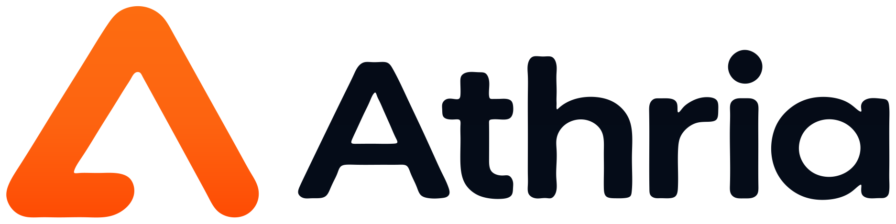

  

# Athria

**A local-first training workspace that helps your AI understand your training data, build plans, and make safer updates.**

[English](#english) · [简体中文](#简体中文) · [Potential contributors / 潜在贡献者](#potential-contributors)

## English

### What is Athria?

Athria is a desktop app for people who want to use an AI assistant with real, structured training data instead of repeatedly explaining their history, goals, equipment, and current plan.

Athria stores your training profile, wellness data, training history, reusable workout templates, and current training cycle on your computer. A compatible AI app can connect to Athria through MCP to read that context, use Athria's calculations and validation, and make approved updates.

**Athria is not an AI model or chat app.** You bring your own MCP-compatible AI client. Athria provides the local data and training tools; the AI client provides the conversation, reasoning, and explanations.

### What can I do with it?

- **Keep training context in one place** — profile, goals, schedule, equipment, wellness, history, templates, and your current training cycle.
- **Connect an AI assistant** — Athria includes connection guidance for ChatGPT, Claude Desktop, Cursor, Qoder, Trae, and WorkBuddy.
- **Review your training** — let an AI assistant inspect recent sessions, summaries, wellness, and data gaps.
- **Build and adjust plans** — create a training cycle, validate it with Athria, and save it after you approve the changes.
- **Use reproducible calculations** — Athria provides deterministic tools for metrics such as estimated 1RM, heart-rate zones, progression, and RPE-based adjustments.
- **Bring in existing data** — import Hevy CSV files, or synchronize read-only data from Intervals.icu and 训记 / Xunji.
- **Keep the main database local** — no Athria account or Athria cloud database is required.

### Getting started

1. **Install Athria**  
   Use a native desktop build for Windows x64 or Apple Silicon macOS. If you are building Athria yourself, see [Potential contributors](#potential-contributors).

2. **Set up your profile**  
   On first launch, create your database password, then fill in Personal Information and Profile with the training information you want Athria to use.

3. **Add training data**  
   Import or synchronize the training sources you want to use. Athria keeps missing information explicitly missing instead of guessing values.

4. **Connect your AI client**  
   Configure Athria as a local stdio MCP server. The command is the installed Athria executable and the argument is **mcp**. Athria includes client-specific setup guidance; the technical interface is documented in [docs/MCP.md](docs/MCP.md).

5. **Start asking about your training**  
   Your AI client can now use Athria's structured data and tools when answering you.

For example:

> Review my last 30 days of training, point out important data gaps, and summarize what has changed.

> Draft a four-week training cycle around my confirmed schedule and equipment. Validate it with Athria, but do not save it until I approve it.

> Check my next training day and suggest an adjustment based on my recent sessions and reported RPE.

When an MCP action would change important stored data, the workflow is designed around explicit user confirmation, validation, and freshness checks rather than silent overwrites.

### Data, privacy, and security

Athria is **local-first**: its primary training database lives on your computer, and Athria does not require its own cloud account.

A few details are worth knowing:

- The local service listens on the loopback interface only; Streamable HTTP requires authentication.
- MCP does not expose arbitrary SQL, arbitrary file access, database deletion, or stored secrets.
- Your database password controls access inside Athria and protects saved connection keys. **The SQLite database file itself is not encrypted at rest.**
- You can back up Athria by copying the database file while following normal SQLite-safe backup practices.
- Local-first storage does not mean your data can never leave your computer: a connected AI client may send the Athria data it reads to its own model provider. That client's privacy policy, configuration, and cost still apply.

### Current limitations

Athria is still an MVP. Today:

- Official desktop targets are **Windows x64** and **Apple Silicon macOS**.
- The app interface is **English-only**.
- Athria has **no built-in LLM or chat interface**.
- Hevy is import-based; Intervals.icu and Xunji integrations are read-only.
- Athria keeps the latest reusable templates and one current editable training cycle; it is not a full plan-versioning system.
- Missing load, RPE/RIR, heart-rate, power, recovery, or wellness data is not treated as normal or inferred automatically.
- Athria does not diagnose injuries, prescribe treatment, or determine whether training is medically safe.

See [Known limitations](docs/KNOWN_LIMITATIONS.md) for the complete current boundary.

### Help and feedback

- [MCP interface and workflows](docs/MCP.md)
- [Known limitations](docs/KNOWN_LIMITATIONS.md)
- [GitHub Issues](https://github.com/whywww/Athria/issues) for bugs and feature requests

When reporting a bug, include your platform, Athria version, reproduction steps, expected result, and actual result. Do not attach credentials or personal training data.

---

## 简体中文

### Athria 是什么？

Athria 是一个本地优先的桌面训练应用，适合希望让 AI 真正理解自己训练数据的人，而不是每次都重新向 AI 解释训练经历、目标、器材和当前计划。

Athria 会在你的电脑上保存个人训练资料、Wellness、训练历史、可复用训练模板和当前训练周期。兼容 MCP 的 AI 客户端可以连接 Athria，读取这些结构化信息，调用 Athria 的确定性计算和计划校验工具，并在你确认后执行受控更新。

**Athria 本身不是 AI 模型，也不是聊天应用。** 你需要使用自己的 MCP 兼容 AI 客户端。Athria 负责本地数据和训练工具，AI 客户端负责对话、推理和解释。

### Athria 可以帮你做什么？

- **集中保存训练上下文** —— 个人资料、目标、日程、器材、Wellness、训练历史、模板和当前训练周期。
- **连接 AI 助手** —— Athria 内置了 ChatGPT、Claude Desktop、Cursor、Qoder、Trae 和 WorkBuddy 的连接说明。
- **回顾近期训练** —— 让 AI 查看近期训练、汇总指标、Wellness 和重要的数据缺口。
- **制定和调整计划** —— 生成训练周期，先由 Athria 校验，再在你批准后保存。
- **使用可复现的训练计算** —— 包括估算 1RM、心率区间、progression 和基于 RPE 的调整等确定性工具。
- **导入已有训练记录** —— 支持 Hevy CSV 导入，以及 Intervals.icu 和训记的只读同步。
- **核心数据保存在本地** —— 不需要 Athria 账号，也不依赖 Athria 云数据库。

### 如何开始使用

1. **安装 Athria**  
   使用适用于 Windows x64 或 Apple Silicon macOS 的原生桌面构建。如果你需要自己从源码构建，请看下方的[潜在贡献者](#potential-contributors)区域。

2. **完成个人设置**  
   第一次启动时创建数据库密码，然后在 Personal Information 和 Profile 中填写你希望 Athria 使用的训练信息。

3. **加入训练数据**  
   导入或同步你希望使用的数据来源。Athria 会把缺失的数据保持为“缺失”，而不是自动猜测。

4. **连接你的 AI 客户端**  
   把 Athria 配置为本地 stdio MCP server。命令使用已经安装的 Athria 可执行文件，参数为 **mcp**。Athria 内置了常见客户端的连接说明，技术接口详见 [docs/MCP.md](docs/MCP.md)。

5. **开始直接询问训练问题**  
   之后你的 AI 客户端就可以在回答时读取 Athria 中的结构化训练数据，并调用相应工具。

例如：

> 查看我最近 30 天的训练，指出重要的数据缺口，并总结最近发生了哪些变化。

> 根据我确认过的日程和器材拟定一个四周训练周期。先用 Athria 校验，但在我批准之前不要保存。

> 查看我的下一个训练日，并结合最近的训练和我报告的 RPE 建议是否需要调整。

当 MCP 操作会修改重要的本地数据时，Athria 的工作流会优先要求明确确认、校验和状态新鲜度检查，而不是静默覆盖。

### 数据、隐私与安全

Athria 是**本地优先**应用：主要训练数据库保存在你的电脑上，不需要 Athria 自己的云账号。

有几点需要明确：

- 本地服务仅监听回环地址；Streamable HTTP 需要身份验证。
- MCP 不暴露任意 SQL、任意文件读取、数据库删除或已保存的密钥。
- 数据库密码用于控制 Athria 内部访问，并保护保存的连接密钥。**SQLite 数据库文件本身并没有做静态加密。**
- 备份的核心方式是复制数据库文件，并遵循正常的 SQLite 安全备份方式。
- “本地优先”并不代表数据绝不会离开电脑：连接的 AI 客户端可能会把它从 Athria 读取的数据发送给自己的模型提供商。该 AI 客户端自身的隐私政策、配置和费用仍然适用。

### 当前限制

Athria 目前仍是 MVP：

- 官方桌面目标为 **Windows x64** 和 **Apple Silicon macOS**。
- 应用界面目前**只有英文**。
- Athria **不内置 LLM 或聊天界面**。
- Hevy 通过文件导入；Intervals.icu 和训记目前只读。
- Athria 保存最新的可复用模板和一个当前可编辑训练周期，并不是完整的计划版本管理系统。
- 缺失的负重、RPE/RIR、心率、功率、恢复或 Wellness 数据不会被自动当成正常值，也不会被猜测补全。
- Athria 不诊断伤病、不提供治疗方案，也不判断训练在医学上是否安全。

完整边界请查看[已知限制](docs/KNOWN_LIMITATIONS.md)。

### 帮助与反馈

- [MCP 接口和工作流](docs/MCP.md)
- [已知限制](docs/KNOWN_LIMITATIONS.md)
- [GitHub Issues](https://github.com/whywww/Athria/issues) 用于 Bug 和功能建议

提交 Bug 时，请包含平台、Athria 版本、复现步骤、预期结果和实际结果。请勿附上凭据或个人训练数据。

---

# Potential contributors / 潜在贡献者

## English

Athria is a Tauri 2 + React desktop application backed by a shared Rust runtime. The dashboard and MCP server use the same application-service boundary so calculations, validation, permissions, and persistence rules do not diverge between interfaces.

### Development setup

Prerequisites:

- Node.js 24+
- pnpm 11.19.0
- Stable Rust toolchain
- Windows x64: Microsoft Visual C++ Build Tools + Windows SDK
- macOS: Apple Silicon + Xcode Command Line Tools

Clone the repository into a directory named **Athria-repo** so generated build output can live in the sibling **Athria** directory:

~~~sh
git clone https://github.com/whywww/Athria.git Athria-repo
cd Athria-repo
pnpm install
pnpm dev
~~~

Useful checks and builds:

~~~sh
pnpm typecheck
pnpm test
pnpm check
cargo test --workspace

pnpm build:debug
pnpm build:app
pnpm release:native
~~~

The default development database is:

- Windows: %LOCALAPPDATA%\Athria\data\athria.sqlite3
- macOS: ~/Library/Application Support/Athria/data/athria.sqlite3

Use **ATHRIA_DATABASE_PATH** for isolated development data. Do not run tests or experiments against personal training data.

### Repository structure

~~~text
apps/
  desktop/       Tauri shell and React dashboard
crates/          Shared Rust core, application, storage, integrations, MCP, runtime
packages/
  skills/        Optional provider-neutral MCP workflows
schemas/         Versioned JSON Schema contracts
scripts/         Development and release tooling
docs/            MCP, limitations, and runtime documentation
~~~

### Contribution expectations

- Keep business rules in the shared Core/application boundary rather than duplicating logic in UI or prompts.
- Do not bypass schemas, permission checks, validation, revision checks, or persistence rules for writes.
- Add or update tests when behavior changes.
- Run **pnpm check** and **cargo test --workspace** before opening a PR.
- Update schemas and documentation when contracts change.
- Open an issue before substantial architecture or schema changes.
- Never commit local databases, imports, backups, credentials, signing material, or generated build artifacts.

Contributions and focused pull requests are welcome.

## 中文

Athria 使用 Tauri 2 + React 构建桌面界面，并由共享 Rust runtime 提供核心能力。Dashboard 和 MCP server 共用同一套 Application Service 边界，因此计算、校验、权限和持久化规则不会因为入口不同而出现两套实现。

### 开发环境

前置条件：

- Node.js 24+
- pnpm 11.19.0
- 稳定版 Rust 工具链
- Windows x64：Microsoft Visual C++ Build Tools + Windows SDK
- macOS：Apple Silicon + Xcode Command Line Tools

建议把仓库克隆到名为 **Athria-repo** 的目录，这样生成的构建产物会写入同级的 **Athria** 目录：

~~~sh
git clone https://github.com/whywww/Athria.git Athria-repo
cd Athria-repo
pnpm install
pnpm dev
~~~

常用检查和构建命令：

~~~sh
pnpm typecheck
pnpm test
pnpm check
cargo test --workspace

pnpm build:debug
pnpm build:app
pnpm release:native
~~~

默认开发数据库位置：

- Windows：%LOCALAPPDATA%\Athria\data\athria.sqlite3
- macOS：~/Library/Application Support/Athria/data/athria.sqlite3

需要隔离开发数据时使用 **ATHRIA_DATABASE_PATH**。不要让测试或实验直接使用个人训练数据。

### 项目结构

~~~text
apps/
  desktop/       Tauri 外壳和 React Dashboard
crates/          共用 Rust Core、Application、存储、集成、MCP 与 runtime
packages/
  skills/        可选、与模型提供商无关的 MCP 工作流
schemas/         版本化 JSON Schema contracts
scripts/         开发和发布工具
docs/            MCP、限制和 runtime 文档
~~~

### 贡献约定

- 业务规则应放在共享 Core / Application 边界中，不要在 UI 或 Prompt 中复制一套逻辑。
- 所有写入都不能绕过 Schema、权限检查、校验、revision 检查或持久化规则。
- 行为发生变化时同步增加或更新测试。
- 提交 PR 前运行 **pnpm check** 和 **cargo test --workspace**。
- Contract 改变时同步更新 Schema 和文档。
- 较大的架构或 Schema 变更请先开 Issue 讨论。
- 不要提交本地数据库、导入文件、备份、凭据、签名材料或生成的构建产物。

欢迎提交聚焦、容易审阅的贡献和 Pull Request。

---

Athria is maintained by [Haoyu Wei](https://github.com/whywww) and contributors.
