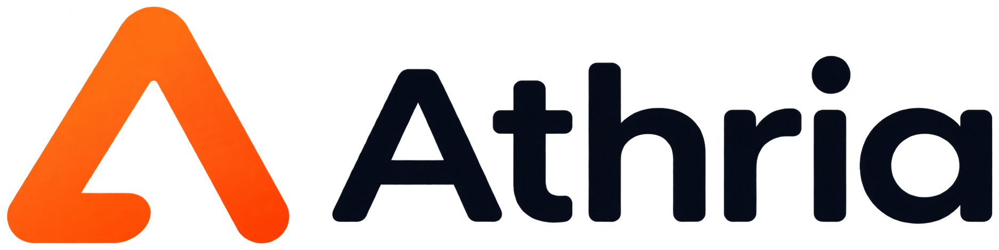

<div align="center">
  

# Athria

**Local-first training data and planning tools for MCP clients.**

[](package.json)


</div>

[English](#english) · [简体中文](#简体中文)

<a id="english"></a>

## English

Athria is a desktop training dashboard and MCP server that keeps an athlete's profile, preferences, training records, session templates, and current mesocycle on their own computer. External MCP clients such as Codex, Claude Desktop, Cursor, Qoder, or Trae can use Athria's structured tools to read training state, calculate metrics, validate plans, and make controlled updates.

Athria's deterministic Core performs calculations and validation; the connected MCP client handles natural-language planning and explanation.

### English contents

- [What Athria does](#what-athria-does)
- [What Athria does not do](#what-athria-does-not-do)
- [Why use Athria](#why-use-athria)
- [Quick start](#quick-start)
- [Connect an MCP client](#connect-an-mcp-client)
- [Example workflow](#example-workflow)
- [Development](#development)
- [Project structure](#project-structure)
- [Data and security](#data-and-security)
- [Documentation and support](#documentation-and-support)
- [Contributing](#contributing)
- [Maintainer](#maintainer)

## What Athria does

The current MCP MVP provides:

- A Tauri 2 and React desktop dashboard for setup, history, training state, devices, templates, and the current mesocycle.
- Local SQLite persistence with migrations, WAL, backup, and restore.
- MCP v2 over stdio, plus authenticated Streamable HTTP on a loopback-only address.
- Deterministic strength and endurance metrics with formula versions and explicit data-quality indicators.
- Plan Schema v4 validation with blocker, advisory, informational, and unknown outcomes.
- A reusable Session Template Library and one editable Current Mesocycle per athlete.
- Optimistic revision checks and validation gates for MCP writes.
- Hevy CSV import with preview-before-commit, plus read-only Intervals.icu and Xunji synchronization.
- Provider-neutral Skills for training-plan workflows and locally synchronized Xunji records.

Athria currently targets Windows x64 and Apple Silicon macOS. The interface is English-only.

## What Athria does not do

Athria does **not** include an LLM, chat interface, hosted AI provider, account system, cloud database, mobile app, or third-party write-back. Your MCP client supplies the model and remains responsible for its own configuration and cost.

Athria also does not diagnose injuries, prescribe treatment, make medical decisions, or certify that a workout is medically safe. Missing health, recovery, load, RPE, heart-rate, or power data remains explicitly missing rather than being treated as normal.

See [Known limitations](docs/KNOWN_LIMITATIONS.md) for the current technical and product boundaries.

## Why use Athria

- **Local by default:** core training data stays on your computer; no Athria cloud service or account is required.
- **Works with your MCP client:** use a compatible external client instead of being locked to one model provider.
- **Reproducible results:** calculations and rules live in a testable Core rather than in model prompts.
- **Safer writes:** schema checks, blocker rules, snapshot freshness, ownership, and revisions protect persisted state.
- **Honest uncertainty:** validation reports missing facts and unknown outcomes instead of inventing inputs.
- **Inspectable workflows:** the dashboard and MCP server use the same application-service boundary.
- **Portable data:** create local backups containing the database and retained imports; credentials are excluded.

## Quick start

### Prerequisites for source builds

- [Bun](https://bun.sh/) 1.4.2
- A stable [Rust](https://www.rust-lang.org/tools/install) toolchain
- Windows x64: Microsoft Visual C++ Build Tools and the Windows SDK
- macOS: Apple Silicon and Xcode Command Line Tools

### Run the development app

```sh
git clone https://github.com/whywww/Athria.git
cd Athria
bun install
bun run dev
```

If dependencies were synchronized from a different operating system, run `bun install --force` once on the current machine.

`bun run dev` starts Vite, the Tauri debug app, and the TypeScript service in watch mode. It does not build a packaged sidecar.

### Build a desktop app

```sh
# Directly runnable host-native debug app
bun run build:debug

# Directly runnable host-native release app
bun run build:app

# Windows: MSI; macOS: app and DMG
bun run release:native
```

Build output defaults to `~/Documents/HAILEY/Athria` and is separated by target triple. Set `ATHRIA_BUILD_ROOT` to use another machine-local output directory. Packaged apps include the service sidecar and do not require Bun, Rust, Node.js, Python, Docker, or an external database at runtime.

On first launch, use the dashboard to complete the athlete profile and preferences, then import or synchronize any training records you want Athria to use.

## Connect an MCP client

Use the installed Athria desktop executable as a stdio MCP server. Replace the command with the actual installation path on your computer.

### Windows

```json
{
  "mcpServers": {
    "Athria": {
      "command": "C:\\Program Files\\Athria\\Athria.exe",
      "args": ["mcp"]
    }
  }
}
```

### macOS

```json
{
  "mcpServers": {
    "Athria": {
      "command": "/Applications/Athria.app/Contents/MacOS/athria",
      "args": ["mcp"]
    }
  }
}
```

Save the configuration and restart the MCP client. Athria reserves stdout for JSON-RPC and sends diagnostics to stderr.

For client-specific setup paths, Streamable HTTP details, and write boundaries, read [MCP setup](docs/MCP.md). Connecting the MCP server does not automatically install the optional Skills in [`packages/skills`](packages/skills).

## Example workflow

After connecting Athria, ask your MCP client:

```text
Review my last 30 days of training, identify any important data gaps, and
draft a four-week mesocycle around my confirmed schedule and equipment.
Validate it with Athria before showing it to me. Do not save anything until
I explicitly approve the plan.
```

A typical planning flow is:

1. Read the confirmed profile, preferences, current state, taxonomy, and relevant history.
2. Surface missing facts that matter to blocker rules.
3. Create or update reusable session templates.
4. Assemble a sparse natural-week mesocycle that references those templates.
5. Validate, revise, and explain the result.
6. Save only after the user confirms the proposed changes.

Profile changes follow a stricter boundary: MCP can propose them, but the user must approve them in the dashboard.

## Development

Install dependencies, then use the root workspace scripts:

```sh
bun install
bun run typecheck
bun run test
bun run check
bun run perf:smoke
```

Useful commands:

| Command | Purpose |
|---|---|
| `bun run dev` | Run the desktop app and development service |
| `bun run service` | Run the local service directly |
| `bun run typecheck` | Type-check all workspaces |
| `bun run test` | Run the Vitest suite |
| `bun run schema:export` | Regenerate exported JSON Schemas |
| `bun run build:service` | Compile the host-native service sidecar |
| `bun run build:app` | Build a directly runnable release app |
| `bun run release:native` | Produce native installer artifacts |

The default development database is stored at:

- Windows: `%LOCALAPPDATA%\Athria\data\athria.sqlite3`
- macOS: `~/Library/Application Support/Athria/data/athria.sqlite3`

Set `ATHRIA_DATA_DIR` or `ATHRIA_DATABASE_PATH` when an isolated development database is needed. Do not point tests or experiments at personal training data.

## Project structure

```text
apps/
  desktop/       Tauri shell and React dashboard
  service/       Bun sidecar, local HTTP API, MCP entry point, and backup
packages/
  application/   Shared use cases and tool registry
  core/          Deterministic calculations and validation
  data/          SQLite persistence and migrations
  integrations/  Training-data adapters
  mcp/           MCP server and transports
  schemas/       Shared Zod contracts
  skills/        Optional provider-neutral MCP workflows
schemas/         Exported JSON Schemas
scripts/         Development and release tooling
```

The dashboard and MCP server call the same application-service boundary. Business writes must not bypass the shared schemas, permission checks, Core validation, or persistence layer.

## Data and security

- The service listens only on `127.0.0.1`, validates the Host header, and restricts browser origins.
- Streamable HTTP requires a bearer token; the dashboard-managed MCP token is stored in the operating-system credential manager and is not exposed through MCP tools.
- MCP does not expose arbitrary SQL, arbitrary file reads, secrets, database deletion, or validation bypasses.
- Backups contain the SQLite database and retained imports but exclude credentials.
- Pre-v0.1 databases are not migrated into this MVP.

Read [Backup and restore](docs/BACKUP.md) before moving or restoring data.

## Documentation and support

- [MCP setup](docs/MCP.md)
- [Backup and restore](docs/BACKUP.md)
- [Known limitations](docs/KNOWN_LIMITATIONS.md)
- [Development plan](docs/DEVELOPMENT_PLAN.md)
- [Release artifacts](docs/RELEASE.md)

For bugs and feature requests, use [GitHub Issues](https://github.com/whywww/Athria/issues). Include the platform, Athria version, reproduction steps, expected result, and actual result. Never attach credentials or personal training data.

## Contributing

Contributions are welcome. Keep changes focused on the MCP application and its deterministic Core.

1. Open an issue before a substantial architectural or schema change.
2. Create a focused branch and add tests for changed behavior.
3. Run `bun run check`.
4. Update schemas and documentation when contracts change.
5. Open a pull request that explains the change and how it was verified.

Do not commit local databases, imports, backups, credentials, signing material, or generated build artifacts.

## Maintainer

Athria is maintained by [Haoyu Wei](https://github.com/whywww) and contributors.

---

<a id="简体中文"></a>

## 简体中文

Athria 是一个本地优先的桌面训练管理应用和 MCP 服务器。运动者的个人资料、偏好、训练记录、训练模板和当前训练周期均保存在自己的电脑上。Codex、Claude Desktop、Cursor、Qoder 或 Trae 等外部 MCP 客户端可以通过 Athria 的结构化工具读取训练状态、计算指标、校验计划并执行受控更新。

Athria 的确定性 Core 负责计算和校验；连接的 MCP 客户端负责理解自然语言、编排计划和解释结果。

### 中文目录

- [Athria 可以做什么](#athria-可以做什么)
- [Athria 不做什么](#athria-不做什么)
- [为什么使用 Athria](#为什么使用-athria)
- [快速开始](#快速开始)
- [连接 MCP 客户端](#连接-mcp-客户端)
- [工作流示例](#工作流示例)
- [开发](#开发)
- [项目结构](#项目结构)
- [数据与安全](#数据与安全)
- [文档与支持](#文档与支持)
- [参与贡献](#参与贡献)
- [维护者](#维护者)

## Athria 可以做什么

当前 MCP MVP 提供：

- 基于 Tauri 2 和 React 的桌面 Dashboard，用于初始设置、训练历史、训练状态、设备连接、训练模板和当前训练周期管理。
- 使用 SQLite、migration 和 WAL 的本地数据持久化，以及备份与恢复能力。
- 基于 stdio 的 MCP v2，以及仅在本机回环地址提供、需要身份验证的 Streamable HTTP。
- 可复现的力量与耐力训练指标，并明确标记公式版本和数据质量。
- 基于 Plan Schema v4 的计划校验，结果分为阻断、建议、信息和未知。
- 可复用的 Session Template Library，以及每位运动者一个可编辑的 Current Mesocycle。
- 使用 revision 乐观锁和校验门禁保护 MCP 写入。
- 提交前可预览的 Hevy CSV 导入，以及只读的 Intervals.icu 和训记同步。
- 面向训练计划工作流和本地训记记录的、与模型提供商无关的 Skills。

Athria 当前支持 Windows x64 和 Apple Silicon Mac，界面语言目前仅为英语。

## Athria 不做什么

Athria **不包含** LLM、内置聊天界面、托管的 AI Provider、账号系统、云数据库、移动应用或向第三方平台回写数据的能力。模型由 MCP 客户端提供，其配置与费用也由该客户端负责。

Athria 不诊断伤病、不提供治疗方案、不作医疗决定，也不保证某项训练在医学上安全。缺失的健康、恢复、负重、RPE、心率或功率数据会保持为缺失状态，不会被解释为正常。

当前技术和产品边界详见[已知限制](docs/KNOWN_LIMITATIONS.md)。

## 为什么使用 Athria

- **默认本地运行：** 核心训练数据保存在自己的电脑上，不需要 Athria 云服务或账号。
- **兼容现有 MCP 客户端：** 可以选择兼容的外部客户端，不被单一模型提供商绑定。
- **结果可复现：** 计算公式和规则位于可测试的 Core，而不是模型提示词中。
- **写入更安全：** Schema、阻断规则、快照时效、数据归属和 revision 共同保护持久化状态。
- **如实呈现不确定性：** 校验会报告缺失事实和未知结果，而不是编造输入。
- **工作流可检查：** Dashboard 和 MCP 服务器共用同一个 Application Service 边界。
- **数据可迁移：** 本地备份包含数据库和保留的导入文件，但不包含凭据。

## 快速开始

### 源码构建前置条件

- [Bun](https://bun.sh/) 1.4.2
- 稳定版 [Rust](https://www.rust-lang.org/tools/install) 工具链
- Windows x64：Microsoft Visual C++ Build Tools 和 Windows SDK
- macOS：Apple Silicon Mac 和 Xcode Command Line Tools

### 运行开发版本

```sh
git clone https://github.com/whywww/Athria.git
cd Athria
bun install
bun run dev
```

如果依赖目录由另一个操作系统同步而来，请在当前电脑上执行一次 `bun install --force`。

`bun run dev` 会启动 Vite、Tauri 调试应用和监视模式下的 TypeScript 服务，但不会构建已打包的 sidecar。

### 构建桌面应用

```sh
# 可直接运行的当前平台调试应用
bun run build:debug

# 可直接运行的当前平台发布应用
bun run build:app

# Windows 生成 MSI；macOS 生成 app 和 DMG
bun run release:native
```

构建产物默认写入 `~/Documents/HAILEY/Athria`，并按 target triple 分开存放。可通过 `ATHRIA_BUILD_ROOT` 指定其他本机输出目录。打包后的应用包含服务 sidecar，运行时不需要 Bun、Rust、Node.js、Python、Docker 或外部数据库。

首次启动后，请先在 Dashboard 中完成运动者资料和偏好设置，再导入或同步希望 Athria 使用的训练记录。

## 连接 MCP 客户端

将安装后的 Athria 桌面可执行文件配置为 stdio MCP 服务器。请把示例中的命令路径替换为电脑上的实际安装路径。

### Windows

```json
{
  "mcpServers": {
    "Athria": {
      "command": "C:\\Program Files\\Athria\\Athria.exe",
      "args": ["mcp"]
    }
  }
}
```

### macOS

```json
{
  "mcpServers": {
    "Athria": {
      "command": "/Applications/Athria.app/Contents/MacOS/athria",
      "args": ["mcp"]
    }
  }
}
```

保存配置后重启 MCP 客户端。Athria 的 stdout 仅用于 JSON-RPC，诊断信息会写入 stderr。

各客户端的具体设置入口、Streamable HTTP 说明和写入边界详见 [MCP 设置](docs/MCP.md)。连接 MCP 服务器不会自动安装 [`packages/skills`](packages/skills) 中的可选 Skills。

## 工作流示例

连接 Athria 后，可以向 MCP 客户端提出：

```text
查看我最近 30 天的训练，指出会影响计划的重要数据缺口，并根据我已确认的
时间和器材拟定一个四周训练周期。先用 Athria 完成校验，再把计划展示给我。
在我明确批准之前，不要保存任何内容。
```

典型的计划工作流是：

1. 读取已确认的个人资料、偏好、当前状态、taxonomy 和相关训练历史。
2. 指出会影响阻断规则的缺失事实。
3. 创建或更新可复用的训练模板。
4. 创建引用这些模板、按自然周稀疏编排的训练周期。
5. 校验、修订并解释结果。
6. 仅在用户确认拟议变更后保存。

个人资料变更具有更严格的边界：MCP 只能提交变更建议，用户必须在 Dashboard 中批准。

## 开发

安装依赖后，使用根工作区脚本：

```sh
bun install
bun run typecheck
bun run test
bun run check
bun run perf:smoke
```

常用命令：

| 命令 | 用途 |
|---|---|
| `bun run dev` | 运行桌面应用和开发服务 |
| `bun run service` | 直接运行本地服务 |
| `bun run typecheck` | 对所有 workspace 进行类型检查 |
| `bun run test` | 运行 Vitest 测试 |
| `bun run schema:export` | 重新生成导出的 JSON Schema |
| `bun run build:service` | 编译当前平台的服务 sidecar |
| `bun run build:app` | 构建可直接运行的发布应用 |
| `bun run release:native` | 生成原生安装包 |

默认开发数据库位置：

- Windows：`%LOCALAPPDATA%\Athria\data\athria.sqlite3`
- macOS：`~/Library/Application Support/Athria/data/athria.sqlite3`

需要隔离的开发数据库时，请设置 `ATHRIA_DATA_DIR` 或 `ATHRIA_DATABASE_PATH`。请勿让测试或实验使用个人训练数据。

## 项目结构

```text
apps/
  desktop/       Tauri 外壳和 React Dashboard
  service/       Bun sidecar、本地 HTTP API、MCP 入口和备份
packages/
  application/   共用的 use case 和工具注册表
  core/          确定性计算和校验
  data/          SQLite 持久化和 migrations
  integrations/  训练数据适配器
  mcp/           MCP 服务器和 transports
  schemas/       共用的 Zod contracts
  skills/        可选、与模型提供商无关的 MCP 工作流
schemas/         导出的 JSON Schemas
scripts/         开发和发布工具
```

Dashboard 和 MCP 服务器调用同一个 Application Service 边界。业务写入不得绕过共用 Schema、权限检查、Core 校验或持久化层。

## 数据与安全

- 服务仅监听 `127.0.0.1`，校验 Host header，并限制浏览器 Origin。
- Streamable HTTP 需要 Bearer Token；Dashboard 管理的 MCP Token 保存在操作系统凭据管理器中，且不会通过 MCP 工具暴露。
- MCP 不提供任意 SQL、任意文件读取、密钥访问、数据库删除或绕过校验的能力。
- 备份包含 SQLite 数据库和保留的导入文件，但不包含凭据。
- 早于 v0.1 的数据库不会迁移至当前 MVP。

移动或恢复数据之前，请阅读[备份与恢复](docs/BACKUP.md)。

## 文档与支持

- [MCP 设置](docs/MCP.md)
- [备份与恢复](docs/BACKUP.md)
- [已知限制](docs/KNOWN_LIMITATIONS.md)
- [开发计划](docs/DEVELOPMENT_PLAN.md)
- [发布产物](docs/RELEASE.md)

Bug 和功能建议请通过 [GitHub Issues](https://github.com/whywww/Athria/issues) 提交。请包含平台、Athria 版本、复现步骤、预期结果和实际结果。请勿附上凭据或个人训练数据。

## 参与贡献

欢迎参与贡献。变更应聚焦当前 MCP 应用及其确定性 Core。

1. 在进行重大架构或 Schema 变更前先创建 Issue。
2. 使用独立分支，并为行为变更添加测试。
3. 运行 `bun run check`。
4. Contract 变化时同步更新 Schema 和文档。
5. 创建 Pull Request，说明变更内容和验证方式。

请勿提交本地数据库、导入文件、备份、凭据、签名材料或构建产物。

## 维护者

Athria 由 [Haoyu Wei](https://github.com/whywww) 和贡献者共同维护。
