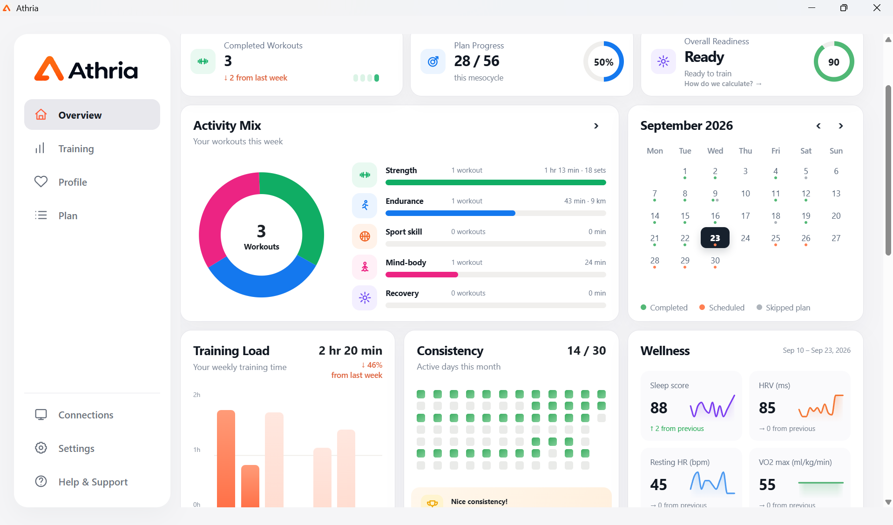
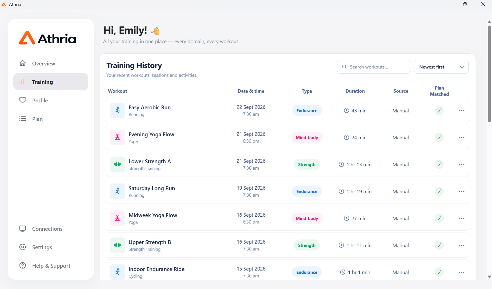
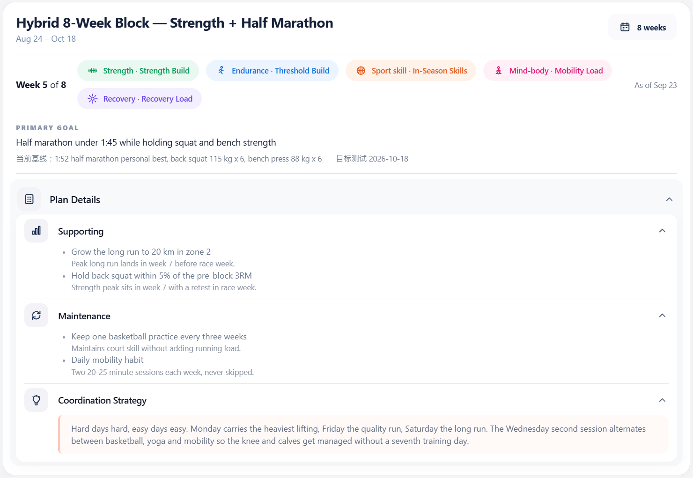
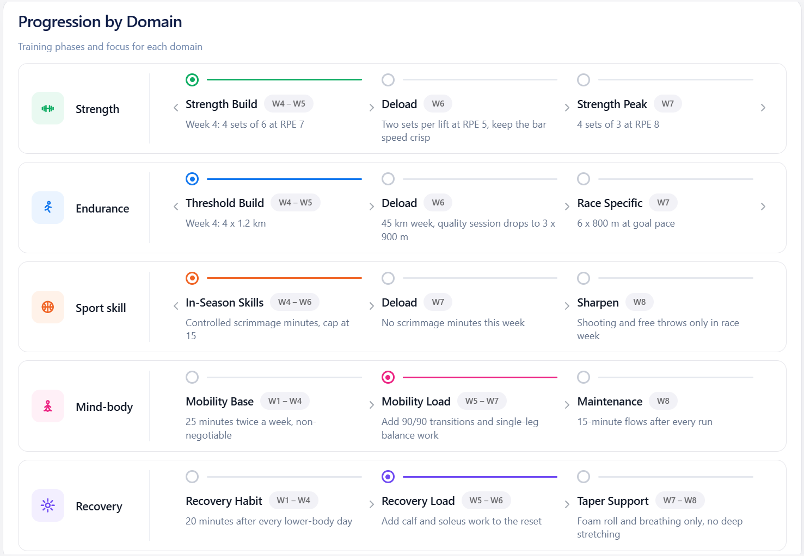
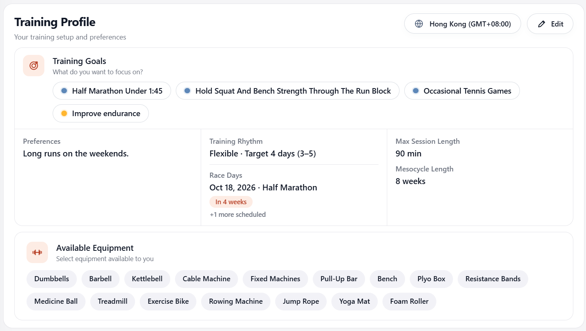
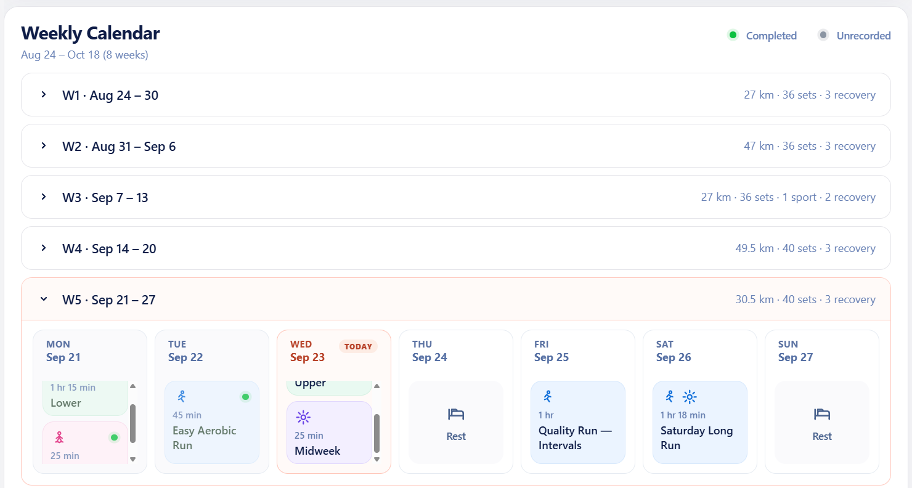

  

# Athria

**Connect your training data to the AI you already use.**

[English](#english) · [简体中文](#简体中文) · [Potential contributors / 潜在贡献者](#potential-contributors)

  
   
  
   
  
  

## English

### What is Athria?

Athria is a free training data and AI companion.

It brings training records from different places together, so the AI you already use can access them with your permission and provide training suggestions and plans based on your actual training.

You do not need to explain your recent training, current plan, available equipment, or goals again in every new conversation. Athria keeps this information organized so it can remain useful across conversations.

You can also use Athria itself to view your training history, recent status, and current plan.

Athria does not tie you to a specific AI. You choose the AI; Athria connects it to your training data.

> **Athria is currently an Alpha project under active development and has not had an official release.** Features and data formats may still change.

### What can I do with it?

- **Bring training data together** — keep your profile, training history, current plan, and day-to-day status in one place.
- **Connect the AI you already use** — let an AI use this context with your permission instead of providing the same background every time.
- **Get personalized training suggestions** — use your goals, recent training, schedule, equipment, and training feedback as context.
- **Build and adjust training plans** — create training schedules around your situation and update them as training progresses.
- **Keep recommendations consistent** — Athria provides shared calculations and plan checks instead of leaving every AI to calculate or guess independently.
- **Bring in existing records** — import or synchronize supported training sources and organize them in one place.
- **View training visually** — use Athria as a hub for your training data, recent status, plans, and connected sources.
- **Keep core data local** — the main training database stays on your computer and does not require an Athria cloud account.

In short:

**Athria organizes your training data; the AI you choose can use it to help with your training.**

### Getting started

1. **Install Athria**  
   Current development builds target Windows x64 and Apple Silicon macOS. If you want to build from source, see [Potential contributors](#potential-contributors).

2. **Add your basic information**  
   Enter your training goals, schedule, equipment, and other information you want an AI to consider.

3. **Add training records**  
   Import existing records or connect one of the currently supported training data sources.

4. **Connect your AI**  
   Athria can connect to ChatGPT, Claude, and other compatible AI clients. Follow the connection guidance in the app. Technical details are available in [docs/MCP.md](docs/MCP.md).

5. **Start using it**  
   Your AI can now use Athria data and training tools within the access you allow.

For example:

> Summarize my last month of training and point out any important changes.

> Based on my goals, schedule, equipment, and recent training, draft a four-week training plan. Check it first and do not save it until I approve it.

> Look at my next training session and tell me whether my recent training and RPE suggest an adjustment.

Before important training data or plans are changed, Athria is designed to require the relevant checks and confirmation rather than silently overwriting existing information.

### Data, privacy, and security

Athria keeps its main training database on your computer and does not require an Athria cloud account.

A few things are worth knowing:

- Athria does not give a connected AI arbitrary access to files, the database, database deletion, or saved secrets.
- The database password controls access inside Athria and protects saved connection keys.
- **The database file itself is not currently encrypted at rest.** Someone with direct access to that file may still be able to read it with SQLite tools.
- Your database can be backed up locally.
- When you allow a third-party AI client to use Athria data, that client may send the data it reads to its own model provider. Its privacy policy, configuration, and pricing still apply.
- Athria itself is free; AI services you choose to connect may have their own charges.

### Current limitations

Athria is currently an **Alpha project under active development and has not had an official release**.

Current limitations include:

- Development and testing currently focus on **Windows x64** and **Apple Silicon macOS**.
- The app interface is currently **English-only**.
- Athria does **not include its own AI model or chat interface**.
- Hevy currently uses file import; Intervals.icu and Xunji synchronization are read-only.
- Athria currently manages the latest reusable templates and one editable training cycle rather than full plan history and versioning.
- Missing load, RPE, heart-rate, power, recovery, or wellness data is not guessed or filled automatically.
- Analysis and rules for some training domains are still under development.
- Athria does not diagnose injuries, provide medical treatment, or determine whether training is medically safe.

See [Known limitations](docs/KNOWN_LIMITATIONS.md) for the complete current boundary.

### Help and feedback

- [AI connection and MCP workflows](docs/MCP.md)
- [Known limitations](docs/KNOWN_LIMITATIONS.md)
- [GitHub Issues](https://github.com/whywww/Athria/issues) for bugs and feature requests

When reporting a bug, include your platform, Athria version, reproduction steps, expected result, and actual result. Do not upload passwords, API keys, personal training databases, or other sensitive data.

---

## 简体中文

### Athria 是什么？

Athria 是一个免费的训练数据和 AI 助手。

它把你分散在不同地方的训练记录集中起来，让你常用的 AI 可以在你的允许下了解这些数据，并根据你的实际训练情况提供更适合你的训练建议和计划。

你不需要每次和 AI 对话时重新解释自己最近练了什么、目前的计划是什么、有哪些器材或者训练目标。Athria 会持续保存和整理这些信息，让它们可以在不同的对话中继续使用。

你也可以直接在 Athria 中查看自己的训练记录、近期状态和训练计划。

Athria 不绑定特定的 AI。你可以继续使用自己选择的 AI，Athria 负责在它和你的训练数据之间建立连接。

> **Athria 目前处于 Alpha 开发阶段，尚未正式发布。** 功能和数据格式仍可能发生变化。

### Athria 可以做什么？

- **集中训练数据** —— 把个人资料、训练记录、训练计划和身体状态等信息整理到一个地方。
- **连接你常用的 AI** —— 让 AI 在你的允许下使用这些数据，不需要每次重新提供背景信息。
- **提供个性化训练建议** —— 根据你的目标、近期训练、时间安排、器材和训练反馈提供建议。
- **制定和调整训练计划** —— 根据你的实际情况生成训练安排，并随着训练进展进行调整。
- **规范训练建议** —— Athria 提供统一的训练计算和计划检查，减少不同 AI 自行猜测或使用不同计算方式带来的差异。
- **整合已有记录** —— 可以导入或同步其他训练应用的数据，并统一整理。
- **可视化查看训练** —— 在 Athria 中查看和管理训练数据、近期状态和计划。
- **数据保存在本地** —— 核心训练数据库保存在自己的电脑上，不需要 Athria 云账号。

简单来说：

**Athria 保存和整理你的训练数据，你选择的 AI 使用这些数据帮助你训练。**

### 如何开始使用

1. **安装 Athria**  
   当前开发版本支持 Windows x64 和 Apple Silicon macOS。如果需要从源码运行，请查看下方的[潜在贡献者](#potential-contributors)部分。

2. **填写基本信息**  
   添加你的训练目标、时间安排、器材和其他希望 AI 在提供建议时考虑的信息。

3. **加入训练记录**  
   你可以导入已有记录，也可以连接目前支持的训练数据来源。

4. **连接你的 AI**  
   Athria 可以连接 ChatGPT、Claude 和其他兼容的 AI 客户端。按照应用内的连接说明完成设置即可。详细接口信息见 [docs/MCP.md](docs/MCP.md)。

5. **开始使用**  
   之后就可以直接向 AI 询问与你训练相关的问题。

例如：

> 总结一下我最近一个月的训练情况，有哪些值得注意的变化？

> 根据我的目标、时间安排和最近的训练，帮我安排接下来四周的训练。先检查计划，在我确认之前不要保存。

> 看一下我下一次应该练什么，并根据最近几次训练和 RPE 判断是否需要调整。

在修改重要的训练数据或计划前，Athria 会要求相应的确认，而不是直接覆盖已有内容。

### 数据、隐私与安全

Athria 的核心训练数据保存在你的电脑上，不需要注册 Athria 云账号。

需要注意：

- Athria 不会向连接的 AI 开放任意文件或数据库访问。
- 数据库密码用于控制 Athria 内部访问，并保护保存的连接密钥。
- **当前数据库文件本身尚未加密。** 如果其他人可以直接访问该文件，仍可能读取其中的数据。
- 数据库可以进行本地备份。
- 当你选择让第三方 AI 使用 Athria 中的数据时，相应数据可能会发送给该 AI 的服务商。具体处理方式取决于你使用的 AI 服务及其隐私政策。
- Athria 本身免费；你选择连接的 AI 服务可能有自己的收费方式。

### 当前限制

Athria 目前处于 **Alpha 开发阶段，尚未正式发布**。

当前主要限制包括：

- 目前主要开发和测试 **Windows x64** 和 **Apple Silicon macOS** 版本。
- 应用界面目前只有英文。
- Athria 本身不提供聊天功能，需要连接你选择的 AI。
- 当前支持 Hevy 文件导入，以及 Intervals.icu 和训记的只读同步。
- 目前主要管理最新的可复用模板和一个正在使用的训练周期，还没有完整的训练计划历史和版本管理。
- 没有记录的负重、RPE、心率、功率、恢复或 Wellness 数据不会由 Athria 自动猜测或补全。
- 部分训练领域的分析和规则仍在开发中。
- Athria 不用于诊断伤病、提供医疗治疗方案或判断训练在医学上是否安全。

更完整的当前边界见[已知限制](docs/KNOWN_LIMITATIONS.md)。

### 帮助与反馈

- [使用 AI 连接 Athria](docs/MCP.md)
- [已知限制](docs/KNOWN_LIMITATIONS.md)
- [GitHub Issues](https://github.com/whywww/Athria/issues) 用于 Bug 和功能建议

提交 Bug 时，请包含操作系统、Athria 版本、复现步骤、预期结果和实际结果。请勿上传密码、API Key、个人训练数据库或其他敏感数据。

---

# Potential contributors / 潜在贡献者

## English

Athria is a Tauri 2 + React desktop application backed by a shared Rust runtime. The dashboard and MCP server use the same application-service boundary so calculations, validation, permissions, and persistence rules do not diverge between interfaces.

### Development setup

Prerequisites:

- Node.js 24+
- pnpm 11.19.0
- Stable Rust toolchain
- Windows x64: Microsoft Visual C++ Build Tools + Windows SDK
- macOS: Apple Silicon + Xcode Command Line Tools

Clone the repository into a directory named **Athria-repo** so generated build output can live in the sibling **Athria** directory:

~~~sh
git clone https://github.com/whywww/Athria.git Athria-repo
cd Athria-repo
pnpm install
pnpm dev
~~~

Useful checks and builds:

~~~sh
pnpm typecheck
pnpm test
pnpm check
cargo test --workspace

pnpm build:debug
pnpm build:app
pnpm release:native
~~~

The default development database is:

- Windows: %LOCALAPPDATA%\Athria\data\athria.sqlite3
- macOS: ~/Library/Application Support/Athria/data/athria.sqlite3

Use **ATHRIA_DATABASE_PATH** for isolated development data. Do not run tests or experiments against personal training data.

### Repository structure

~~~text
apps/
  desktop/       Tauri shell and React dashboard
crates/          Shared Rust core, application, storage, integrations, MCP, runtime
packages/
  skills/        Optional provider-neutral MCP workflows
schemas/         Versioned JSON Schema contracts
scripts/         Development and release tooling
docs/            MCP, limitations, and runtime documentation
~~~

### Contribution expectations

- Keep business rules in the shared Core/application boundary rather than duplicating logic in UI or prompts.
- Do not bypass schemas, permission checks, validation, revision checks, or persistence rules for writes.
- Add or update tests when behavior changes.
- Run **pnpm check** and **cargo test --workspace** before opening a PR.
- Update schemas and documentation when contracts change.
- Open an issue before substantial architecture or schema changes.
- Never commit local databases, imports, backups, credentials, signing material, or generated build artifacts.

Contributions and focused pull requests are welcome.

## 中文

Athria 使用 Tauri 2 + React 构建桌面界面，并由共享 Rust runtime 提供核心能力。Dashboard 和 MCP server 共用同一套 Application Service 边界，因此计算、校验、权限和持久化规则不会因为入口不同而出现两套实现。

### 开发环境

前置条件：

- Node.js 24+
- pnpm 11.19.0
- 稳定版 Rust 工具链
- Windows x64：Microsoft Visual C++ Build Tools + Windows SDK
- macOS：Apple Silicon + Xcode Command Line Tools

建议把仓库克隆到名为 **Athria-repo** 的目录，这样生成的构建产物会写入同级的 **Athria** 目录：

~~~sh
git clone https://github.com/whywww/Athria.git Athria-repo
cd Athria-repo
pnpm install
pnpm dev
~~~

常用检查和构建命令：

~~~sh
pnpm typecheck
pnpm test
pnpm check
cargo test --workspace

pnpm build:debug
pnpm build:app
pnpm release:native
~~~

默认开发数据库位置：

- Windows：%LOCALAPPDATA%\Athria\data\athria.sqlite3
- macOS：~/Library/Application Support/Athria/data/athria.sqlite3

需要隔离开发数据时使用 **ATHRIA_DATABASE_PATH**。不要让测试或实验直接使用个人训练数据。

### 项目结构

~~~text
apps/
  desktop/       Tauri 外壳和 React Dashboard
crates/          共用 Rust Core、Application、存储、集成、MCP 与 runtime
packages/
  skills/        可选、与模型提供商无关的 MCP 工作流
schemas/         版本化 JSON Schema contracts
scripts/         开发和发布工具
docs/            MCP、限制和 runtime 文档
~~~

### 贡献约定

- 业务规则应放在共享 Core / Application 边界中，不要在 UI 或 Prompt 中复制一套逻辑。
- 所有写入都不能绕过 Schema、权限检查、校验、revision 检查或持久化规则。
- 行为发生变化时同步增加或更新测试。
- 提交 PR 前运行 **pnpm check** 和 **cargo test --workspace**。
- Contract 改变时同步更新 Schema 和文档。
- 较大的架构或 Schema 变更请先开 Issue 讨论。
- 不要提交本地数据库、导入文件、备份、凭据、签名材料或生成的构建产物。

欢迎提交聚焦、容易审阅的贡献和 Pull Request。

---

Athria is maintained by [Haoyu Wei](https://github.com/whywww) and contributors.
