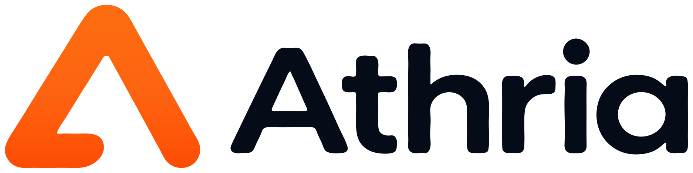
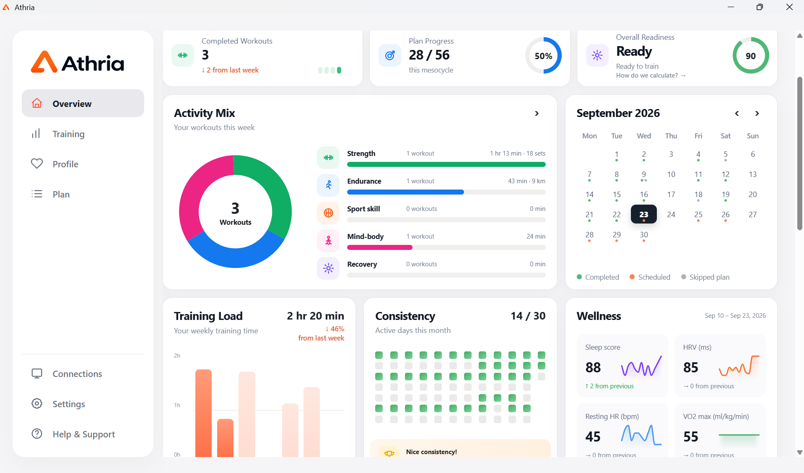
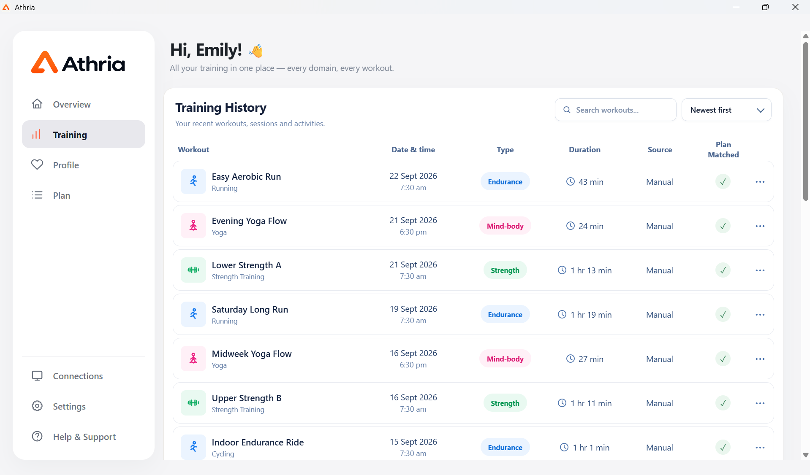
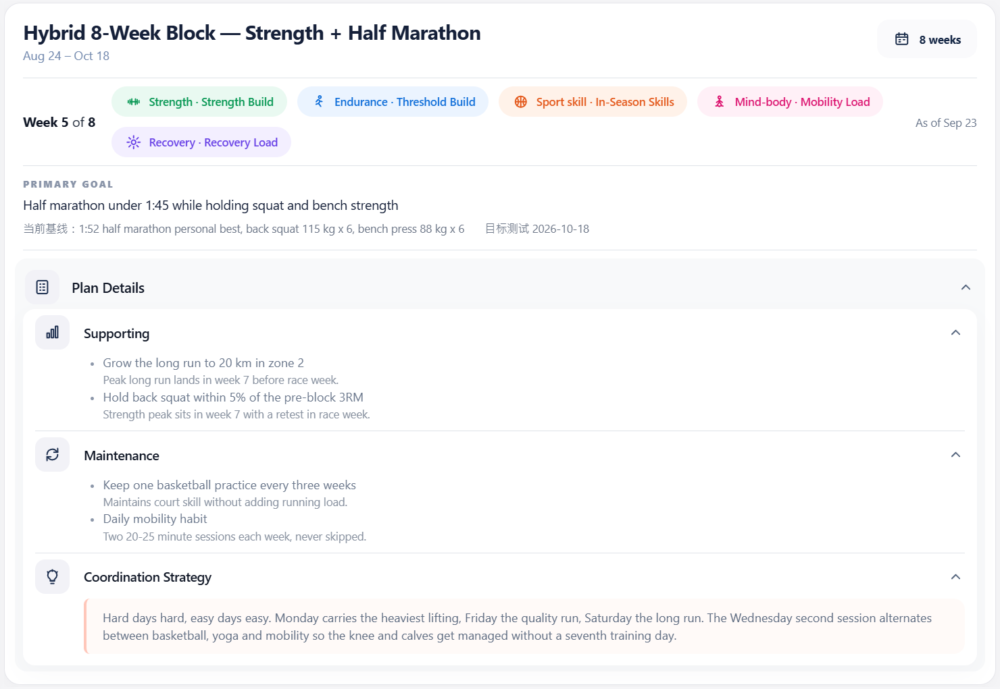
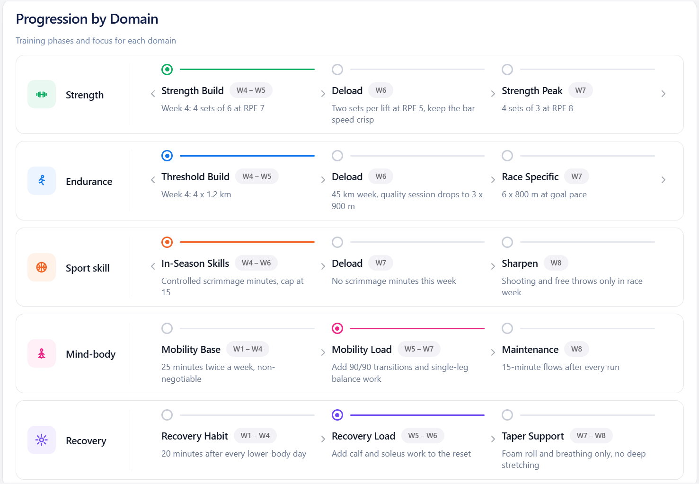
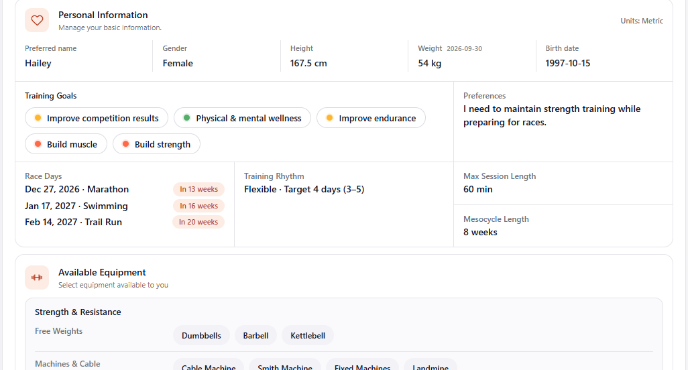
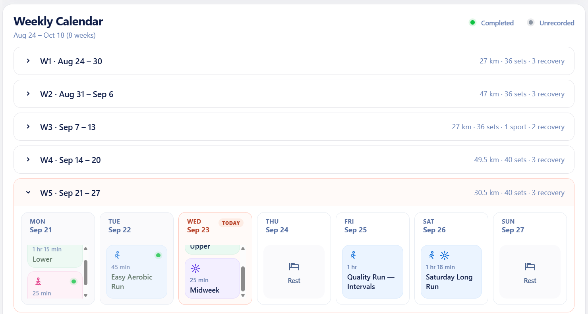

  

# Athria

**Connect your training data to the AI you already use.**

[English](#english) · [简体中文](#简体中文) · [Potential contributors / 潜在贡献者](#potential-contributors)

  
   
  
   
  
  

## English

### What is Athria?

Athria is a free training data and AI companion.

It brings training records from different places together, so the AI you already use can access them with your permission and provide training suggestions and plans based on your actual training.

You do not need to explain your recent training, current plan, available equipment, or goals again in every new conversation. Athria keeps this information organized so it can remain useful across conversations.

You can also use Athria itself to view your training history, recent status, and current plan.

Athria does not tie you to a specific AI. You choose the AI; Athria connects it to your training data.

> **Athria 0.2.1-beta.1 is a beta pre-release under active development.** Features and data formats may still change.

### What can I do with it?

- **Bring training data together** — keep your profile, training history, current plan, and day-to-day status in one place.
- **Connect the AI you already use** — let an AI use this context with your permission instead of providing the same background every time.
- **Get personalized training suggestions** — use your goals, recent training, schedule, equipment, and training feedback as context.
- **Build and adjust training plans** — create training schedules around your situation and update them as training progresses.
- **Keep recommendations consistent** — Athria provides shared calculations and plan checks instead of leaving every AI to calculate or guess independently.
- **Bring in existing records** — import or synchronize supported training sources and organize them in one place. Currently supported apps include **SynFit** and **Intervals.icu**. For other apps, please submit an Issue.
- **View training visually** — use Athria as a hub for your training data, recent status, plans, and connected sources.
- **Keep core data local** — the main training database stays on your computer and does not require an Athria cloud account.

In short:

**Athria organizes your training data; the AI you choose can use it to help with your training.**

### Getting started

1. **Install Athria**  
   Current development builds target Windows x64 and Apple Silicon macOS. If you want to build from source, see [Potential contributors](#potential-contributors).

2. **Add your basic information**  
   In Profile page, enter your training goals, schedule, equipment, and other information you want an AI to consider.

3. **Add training records**  
   In Connections page, connect one of the currently supported training data sources to import existing records, or ask your AI agents to import for you.

4. **Connect your AI**  
   Athria can connect to ChatGPT, Claude, and other compatible AI clients. Follow the connection guidance in the app. Technical details are available in [docs/MCP.md](docs/MCP.md).

5. **Start using it**  
   Your AI can now use Athria data and training tools within the access you allow.

For example:

> Summarize my last month of training and point out any important changes.

> Based on my goals, schedule, equipment, and recent training, draft a four-week training plan. Check it first and do not save it until I approve it.

> Look at my next training session and tell me whether my recent training and RPE suggest an adjustment.

Before important training data or plans are changed, Athria is designed to require the relevant checks and confirmation rather than silently overwriting existing information.

### Data, privacy, and security

Athria keeps its main training database on your computer and does not require an Athria cloud account.

A few things are worth knowing:

- Athria does not give a connected AI arbitrary access to files, the database, database deletion, or saved secrets.
- The database password controls access inside Athria and protects saved connection keys.
- **The database file itself is not currently encrypted at rest.** Someone with direct access to that file may still be able to read it with SQLite tools.
- Your database can be backed up locally.
- Athria and its MCP tools open the same selected SQLite file directly. A successful save is committed to that database. SQLite may briefly create a `-journal` file during a write and removes it after the transaction. Quit Athria and connected AI clients before copying the single database file for a backup. You may choose a cloud-synced folder, but Athria does not merge edits made on different devices or cloud copies.
- When you allow a third-party AI client to use Athria data, that client may send the data it reads to its own model provider. Its privacy policy, configuration, and pricing still apply.
- Athria itself is free; AI services you choose to connect may have their own charges.

### Current limitations

Athria 0.2.1-beta.1 is a **beta pre-release under active development**.

Current limitations include:

- Current native development and testing targets are **Windows x64** and **Apple Silicon macOS**. Linux and mobile clients are future work.
- The app interface supports **English** and **Simplified Chinese**.
- Athria does **not include its own AI model or chat interface**.
- Intervals.icu and SynFit synchronization are read-only.
- Athria currently manages the latest reusable templates and one editable training cycle rather than full plan history and versioning.
- Missing load, RPE, heart-rate, power, recovery, or wellness data is not guessed or filled automatically.
- Analysis and rules for some training domains are still under development.
- Athria does not diagnose injuries, provide medical treatment, or determine whether training is medically safe.

See [Known limitations](docs/KNOWN_LIMITATIONS.md) for the complete current boundary.

### Help and feedback

- [AI connection and MCP workflows](docs/MCP.md)
- [Known limitations](docs/KNOWN_LIMITATIONS.md)
- [GitHub Issues](https://github.com/whywww/Athria/issues) for bugs and feature requests

When reporting a bug, include your platform, Athria version, reproduction steps, expected result, and actual result. Do not upload passwords, API keys, personal training databases, or other sensitive data.

---

## 简体中文

### Athria 是什么？

Athria 是一个免费的训练数据和 AI 助手。

它把你分散在不同地方的训练记录集中起来，让你常用的 AI 可以在你的允许下了解这些数据，并根据你的实际训练情况提供更适合你的训练建议和计划。

你不需要每次和 AI 对话时重新解释自己最近练了什么、目前的计划是什么、有哪些器材或者训练目标。Athria 会持续保存和整理这些信息，让它们可以在不同的对话中继续使用。

你也可以直接在 Athria 中查看自己的训练记录、近期状态和训练计划。

Athria 不绑定特定的 AI。你可以继续使用自己选择的 AI，Athria 负责在它和你的训练数据之间建立连接。

> **Athria 0.2.1-beta.1 是仍在开发中的 Beta 预发布版本。** 功能和数据格式仍可能发生变化。

### Athria 可以做什么？

- **集中训练数据** —— 把个人资料、训练记录、训练计划和身体状态等信息整理到一个地方。
- **连接你常用的 AI** —— 让 AI 在你的允许下使用这些数据，不需要每次重新提供背景信息。
- **提供个性化训练建议** —— 根据你的目标、近期训练、时间安排、器材和训练反馈提供建议。
- **制定和调整训练计划** —— 根据你的实际情况生成训练安排，并随着训练进展进行调整。
- **规范训练建议** —— Athria 提供统一的训练计算和计划检查，减少不同 AI 自行猜测或使用不同计算方式带来的差异。
- **整合已有记录** —— 可以导入或同步其他训练应用的数据，并统一整理。目前支持 **训记**、**Intervals.icu**。如果有其他需求，可以提交 Issues。
- **可视化查看训练** —— 在 Athria 中查看和管理训练数据、近期状态和计划。
- **数据保存在本地** —— 核心训练数据库保存在自己的电脑上，不需要 Athria 云账号。

简单来说：

**Athria 保存和整理你的训练数据，你选择的 AI 使用这些数据帮助你训练。**

### 如何开始使用

1. **安装 Athria**  
   当前开发版本支持 Windows x64 和 Apple Silicon macOS。如果需要从源码运行，请查看下方的[潜在贡献者](#potential-contributors)部分。

2. **填写基本信息**  
   在档案页中，添加你的训练目标、时间安排、器材和其他希望 AI 在提供建议时考虑的信息。

3. **加入训练记录**  
   在连接页中，你可以连接目前支持的训练数据来源，导入已有记录，或者通过 AI 助手写入。

4. **连接你的 AI**  
   Athria 可以连接 ChatGPT、Claude 和其他兼容的 AI 客户端。按照应用内的连接说明完成设置即可。详细接口信息见 [docs/MCP.md](docs/MCP.md)。

5. **开始使用**  
   之后就可以直接向 AI 询问与你训练相关的问题。

例如：

> 总结一下我最近一个月的训练情况，有哪些值得注意的变化？

> 根据我的目标、时间安排和最近的训练，帮我安排接下来四周的训练。先检查计划，在我确认之前不要保存。

> 看一下我下一次应该练什么，并根据最近几次训练和 RPE 判断是否需要调整。

在修改重要的训练数据或计划前，Athria 会要求相应的确认，而不是直接覆盖已有内容。

### 数据、隐私与安全

Athria 的核心训练数据保存在你的电脑上，不需要注册 Athria 云账号。

需要注意：

- Athria 不会向连接的 AI 开放任意文件或数据库访问。
- 数据库密码用于控制 Athria 内部访问，并保护保存的连接密钥。
- **当前数据库文件本身尚未加密。** 如果其他人可以直接访问该文件，仍可能读取其中的数据。
- 数据库可以进行本地备份。
- Athria 和连接的 AI 工具直接打开同一个所选数据库文件。保存成功表示修改已经提交到该数据库。SQLite 写入期间可能短暂产生 `-journal` 文件，事务结束后会删除。复制单文件备份前，请退出 Athria 和连接的 AI 客户端。可以选择云盘同步目录，但 Athria 不会合并不同设备或云盘副本上的修改。
- 当你选择让第三方 AI 使用 Athria 中的数据时，相应数据可能会发送给该 AI 的服务商。具体处理方式取决于你使用的 AI 服务及其隐私政策。
- Athria 本身免费；你选择连接的 AI 服务可能有自己的收费方式。

### 当前限制

Athria 0.2.1-beta.1 是**仍在开发中的 Beta 预发布版本**。

当前主要限制包括：

- 当前原生开发和测试目标为 **Windows x64** 和 **Apple Silicon macOS**；Linux 和移动客户端属于未来事项。
- 应用界面支持**英文**和**简体中文**。
- Athria 本身不提供聊天功能，需要连接你选择的 AI。
- Intervals.icu 和训记目前提供只读同步。
- 目前主要管理最新的可复用模板和一个正在使用的训练周期，还没有完整的训练计划历史和版本管理。
- 没有记录的负重、RPE、心率、功率、恢复或 Wellness 数据不会由 Athria 自动猜测或补全。
- 部分训练领域的分析和规则仍在开发中。
- Athria 不用于诊断伤病、提供医疗治疗方案或判断训练在医学上是否安全。

更完整的当前边界见[已知限制](docs/KNOWN_LIMITATIONS.md)。

### 帮助与反馈

- [Athria 的数据如何保持更新](docs/DATA_SYNC.md)
- [使用 AI 连接 Athria](docs/MCP.md)
- [已知限制](docs/KNOWN_LIMITATIONS.md)
- [GitHub Issues](https://github.com/whywww/Athria/issues) 用于 Bug 和功能建议

提交 Bug 时，请包含操作系统、Athria 版本、复现步骤、预期结果和实际结果。请勿上传密码、API Key、个人训练数据库或其他敏感数据。

---

# Potential contributors / 潜在贡献者

## English

Athria is a Tauri 2 + React desktop application backed by a shared Rust runtime. The dashboard and MCP server use the same application-service boundary so calculations, validation, permissions, and persistence rules do not diverge between interfaces.

### Development setup

Prerequisites:

- Node.js 24+
- pnpm 11.19.0
- Stable Rust toolchain
- Windows x64: Microsoft Visual C++ Build Tools + Windows SDK
- macOS: Apple Silicon + Xcode Command Line Tools

Clone the repository into a directory named **Athria-repo** so generated build output can live in the sibling **Athria** directory:

~~~sh
git clone https://github.com/whywww/Athria.git Athria-repo
cd Athria-repo
pnpm install
pnpm dev
~~~

Useful checks and builds:

~~~sh
pnpm typecheck
pnpm test
pnpm check
cargo test --workspace

pnpm build:debug
pnpm build:app
pnpm release:native
~~~

Run these commands from the repository root, where `package.json` lives. In
PowerShell, if the prompt is in another directory (for example
`C:\Windows\System32`), run:

~~~powershell
Set-Location '<path-to-Athria-repo>'
pnpm build:app
~~~

The default development database is:

- Windows: %LOCALAPPDATA%\Athria\data\athria.sqlite3
- macOS: ~/Library/Application Support/Athria/data/athria.sqlite3

Use **ATHRIA_DATABASE_PATH** for isolated development data. Do not run tests or experiments against personal training data.

#### macOS database password

On macOS, Athria asks for its database password each time it starts and keeps the unlocked key only in memory. The "Remember on this computer" option remains available on Windows. macOS development app builds use ad-hoc signing and do not need a local signing certificate.

Athria does not read, write, or delete macOS Keychain items. Old Athria entries can remain in Keychain without affecting the app or causing a password prompt. To remove them, open Keychain Access, search for `Athria`, and delete them manually. Legacy API keys stored separately in Keychain are not migrated on macOS; re-enter those keys in Connections if needed. Public macOS distribution requires a separate Developer ID signing and notarization workflow.

### Repository structure

~~~text
apps/
  desktop/       Tauri shell and React dashboard
crates/          Shared Rust core, application, storage, integrations, MCP, runtime
packages/
  skills/        Optional provider-neutral MCP workflows
schemas/         Versioned JSON Schema contracts
scripts/         Development and release tooling
docs/            MCP, limitations, and runtime documentation
~~~

### Contribution expectations

- Keep business rules in the shared Core/application boundary rather than duplicating logic in UI or prompts.
- Do not bypass schemas, permission checks, validation, revision checks, or persistence rules for writes.
- Add or update tests when behavior changes.
- Run **pnpm check** and **cargo test --workspace** before opening a PR.
- Update schemas and documentation when contracts change.
- Open an issue before substantial architecture or schema changes.
- Never commit local databases, imports, backups, credentials, signing material, or generated build artifacts.

Contributions and focused pull requests are welcome.

## 中文

Athria 使用 Tauri 2 + React 构建桌面界面，并由共享 Rust runtime 提供核心能力。Dashboard 和 MCP server 共用同一套 Application Service 边界，因此计算、校验、权限和持久化规则不会因为入口不同而出现两套实现。

### 开发环境

前置条件：

- Node.js 24+
- pnpm 11.19.0
- 稳定版 Rust 工具链
- Windows x64：Microsoft Visual C++ Build Tools + Windows SDK
- macOS：Apple Silicon + Xcode Command Line Tools

建议把仓库克隆到名为 **Athria-repo** 的目录，这样生成的构建产物会写入同级的 **Athria** 目录：

~~~sh
git clone https://github.com/whywww/Athria.git Athria-repo
cd Athria-repo
pnpm install
pnpm dev
~~~

常用检查和构建命令：

~~~sh
pnpm typecheck
pnpm test
pnpm check
cargo test --workspace

pnpm build:debug
pnpm build:app
pnpm release:native
~~~

请在含有 `package.json` 的仓库根目录运行这些命令。如果 PowerShell
当前位于其他目录（例如 `C:\Windows\System32`），先执行：

~~~powershell
Set-Location '<Athria-repo 的实际路径>'
pnpm build:app
~~~

默认开发数据库位置：

- Windows：%LOCALAPPDATA%\Athria\data\athria.sqlite3
- macOS：~/Library/Application Support/Athria/data/athria.sqlite3

macOS 每次启动都要求输入 Athria 数据库密码，不提供“在此设备上记住密码”。开发构建恢复使用 ad hoc 签名，无须创建本机证书。Athria 不会读取、写入或删除 macOS 钥匙串项目；旧记录保留也不会影响应用或触发密码弹窗。如需清理，可打开「钥匙串访问」、搜索 `Athria` 后手动删除。旧版单独保存在钥匙串中的 API key 不会在 Mac 上自动迁移，需要时请在「连接」中重新输入。正式发布仍需单独处理 Developer ID 签名和公证。

需要隔离开发数据时使用 **ATHRIA_DATABASE_PATH**。不要让测试或实验直接使用个人训练数据。

### 项目结构

~~~text
apps/
  desktop/       Tauri 外壳和 React Dashboard
crates/          共用 Rust Core、Application、存储、集成、MCP 与 runtime
packages/
  skills/        可选、与模型提供商无关的 MCP 工作流
schemas/         版本化 JSON Schema contracts
scripts/         开发和发布工具
docs/            MCP、限制和 runtime 文档
~~~

### 贡献约定

- 业务规则应放在共享 Core / Application 边界中，不要在 UI 或 Prompt 中复制一套逻辑。
- 所有写入都不能绕过 Schema、权限检查、校验、revision 检查或持久化规则。
- 行为发生变化时同步增加或更新测试。
- 提交 PR 前运行 **pnpm check** 和 **cargo test --workspace**。
- Contract 改变时同步更新 Schema 和文档。
- 较大的架构或 Schema 变更请先开 Issue 讨论。
- 不要提交本地数据库、导入文件、备份、凭据、签名材料或生成的构建产物。

欢迎提交聚焦、容易审阅的贡献和 Pull Request。

---

Athria is maintained by [Haoyu Wei](https://github.com/whywww) and contributors.

## License / 许可证

Copyright © 2026 Haoyu Wei.

Athria is licensed under the [PolyForm Noncommercial License 1.0.0](LICENSE). You may use, modify, and distribute Athria for permitted noncommercial purposes subject to the license terms. Commercial use requires prior written authorization from the copyright holder. For commercial licensing inquiries, contact [Haoyu Wei](https://github.com/whywww). See the [`LICENSE`](LICENSE) file for the full terms.

Athria 采用 [PolyForm Noncommercial License 1.0.0](LICENSE) 许可。在遵守许可证条款的前提下，你可以将 Athria 用于许可的非商业用途，也可以修改和分发本项目。任何商业用途均须事先获得版权所有者的书面授权。如需咨询商业许可，请联系 [Haoyu Wei](https://github.com/whywww)。完整条款请参阅 [`LICENSE`](LICENSE) 文件。
